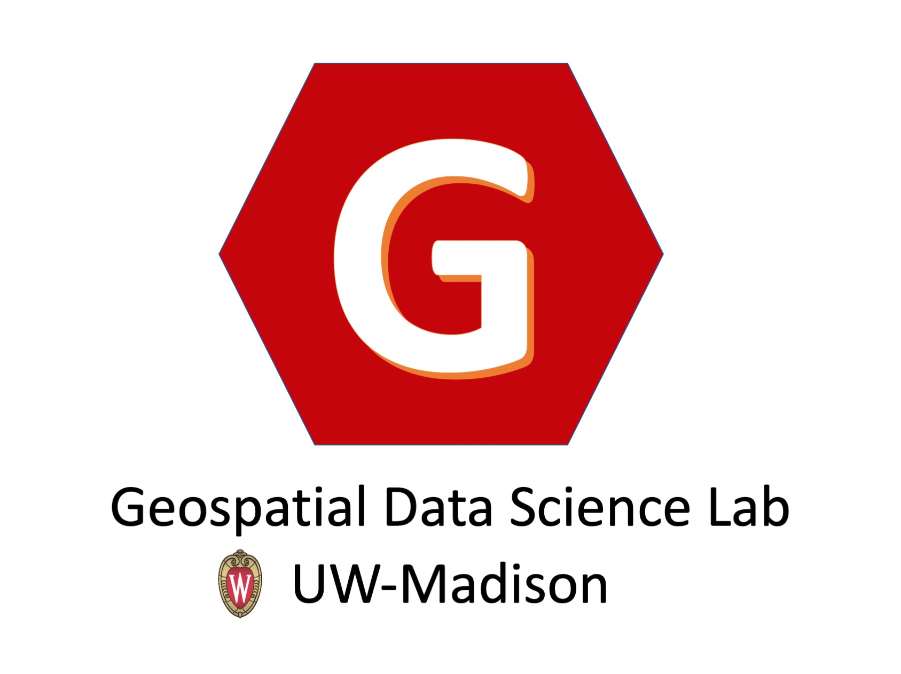
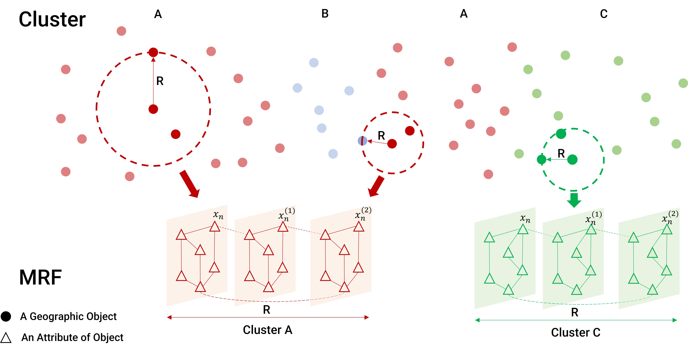

[](https://opensource.org/licenses/BSD-2-Clause)

<!-- PROJECT LOGO -->
<br />
<p align="center">
  <a href="https://geods.geography.wisc.edu/">
    

  <h2 align="center">STICC: A multivariate spatial clustering method for repeated geographic pattern discovery with consideration of spatial contiguity</h2>

  <p align="center">
    GeoDS Lab, Department of Geography, University of Wisconsin-Madison.
    <br />
  </p>
</p>

<!-- TABLE OF CONTENTS -->
## Table of Contents

* [Citation](#citation)
* [About the Project](#about-the-project)
* [Code Usage](#code-usage)
* [Folder Structure](#folder-structure)
* [License](#license)
* [Contact](#contact)
* [Acknowledgements](#acknowledgements)

<!-- Citation -->
## Citation
If you use this algorithm in your research or applications, please cite this source:

Kang, Y., Wu, K., Gao, S., Ng, I., Rao, J., Ye, S., Zhang, F. and Fei, T. STICC: A multivariate spatial clustering method for repeated geographic pattern discovery with consideration of spatial contiguity. *International Journal of Geographical Information Science* (2022).
    

```
@article{kang2022sticc,
  title     = {STICC: A multivariate spatial clustering method for repeated geographic pattern discovery with consideration of spatial contiguity},
  author    = {Kang, Yuhao and Wu, Kunlin and Gao, Song and Ng, Ignavier and Rao, Jinmeng and Ye, Shan and Zhang, Fan and Fei, Teng},
  journal   = {International Journal of Geographical Information Science},
  year = {2022}
}
```

<!-- ABOUT THE PROJECT -->
## About The Project
Spatial clustering has been widely used for spatial data mining and knowledge discovery. An ideal multivariate spatial clustering should consider both spatial contiguity and aspatial attributes. Existing spatial clustering approaches may face challenges for discovering repeated geographic patterns with spatial contiguity maintained. In this paper, we propose a Spatial Toeplitz Inverse Covariance-Based Clustering (STICC) method that considers both attributes and spatial relationships of geographic objects for multivariate spatial clustering. A subregion is created for each geographic object serving as the basic unit when performing clustering. A Markov random eld (MRF) is then constructed to characterize the attribute dependencies of subregions. Using a spatial consistency strategy, nearby objects are encouraged to belong to the same cluster. To test the performance of the proposed STICC algorithm, we apply it in two use cases. The comparison results with several baseline methods show that the STICC outperforms others significantly in terms of adjusted rand index and macro-F1. Joint count statistics is also calculated and shows that the spatial contiguity is well preserved by STICC. Such a spatial clustering method may benet various applications in the fields of geography, remote sensing, transportation, and urban planning, etc.

The general idea of the STICC algorithm is illustrated as follows:  
<p align="center">
    
</p>


The STICC algorithm is developed based on TICC algorithm:  
D. Hallac, S. Vare, S. Boyd, and J. Leskovec Toeplitz Inverse Covariance-Based Clustering of Multivariate Time Series Data. *Proceedings of the 23rd ACM SIGKDD International Conference on Knowledge Discovery and Data Mining* 215--223 (2017)

## Code Usage

Environment: Python 3.7 or newer

#### Experiment Reproduction
To reproduce the experiments in the paper, please check the three jupyter notebooks: synthetic.ipynb, NYC_checkin.ipynb, NYC_checkin3.ipynb. All datasets have been uplodaded in the folder <em>data/</em>


#### Execute Python Code
To perform STICC on your own dataset, please run the following code in python.  

Usage:  
    
```
python STICC_main.py --fname=[input_data] --oname=[output_data] \
--attr_idx_start=[attr_idx_start] --attr_idx_end=[attr_idx_end] \
--spatial_idx_start=[spatial_idx_start] --spatial_idx_end=[spatial_idx_end] --spatial_radius=[spatial_radius] \
--number_of_clusters=[number_of_clusters] --lambda_parameter=[lambda_parameter] --beta=[beta] --maxIters=[maxIters]
```


```
--fname, input data name
--oname, output file name
--attr_idx_start, attribute start index
--attr_idx_end, attribute end index
--spatial_idx_start, neighboring object start index
--spatial_idx_end, neighboring object end index
--spatial_radius, radius of subregion
--number_of_clusters, number of clusters
--lambda_parameter, lambda
--beta, beta
--maxIters, maximum iterations
```


Example:    
Perform STICC on the synthetic_data.txt with spatial radius=3 and beta=3.     
```
python STICC_main.py --fname=synthetic_data.txt --oname=result_synthetic_data.txt \
--attr_idx_start=1 --attr_idx_end=5 --spatial_idx_start=6 --spatial_idx_end=8 \
--spatial_radius=3 --number_of_clusters 7 --lambda_parameter 0.01 --beta 3 --maxIters 20 
```


If you meet the following error:   
```
numpy.linalg.LinAlgError: Eigenvalues did not converge
```

A potential solution is to standardize your dataset.    

## Folder Structure 
The folders and files are organized as follows.   
```
project
|-- data
|-- images
|-- src
|   |-- __init__.py
|   |-- admm_solver.py
|   `-- STICC_helper.py
|-- STICC_main.py
|-- STICC_solver.py
|-- synthetic.ipynb
|-- NYC_checkin.ipynb
`-- NYC_checkin3.ipynb
```

<!-- LICENSE -->
## License

Distributed under the MIT License. See `LICENSE` for more information.

<!-- CONTACT -->
## Contact

Yuhao Kang - [@YuhaoKang](https://twitter.com/YuhaoKang) - yuhao.kang at wisc.edu  
Song Gao - [@gissong](https://twitter.com/gissong) - song.gao at wisc.edu  

Project Link: [https://github.com/GeoDS/STICC](https://github.com/GeoDS/STICC)  

<!-- ACKNOWLEDGEMENTS -->
## Acknowledgements

Code borrows from [TICC](https://github.com/davidhallac/TICC).

<!-- MARKDOWN LINKS & IMAGES -->
[license-shield]: https://img.shields.io/github/license/othneildrew/Best-README-Template.svg?style=flat-square
[license-url]: https://github.com/GeoDS/COVID19USFlows/blob/master/LICENSE.txt
